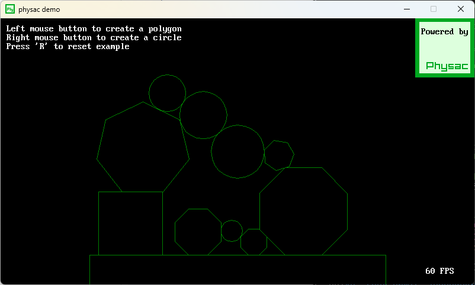
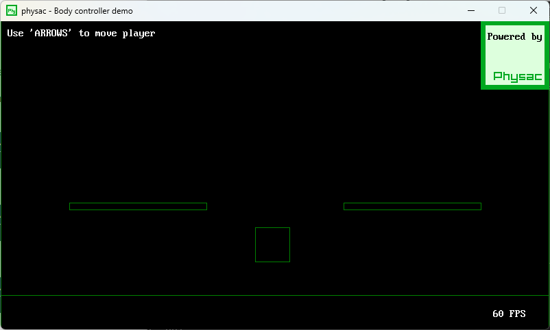
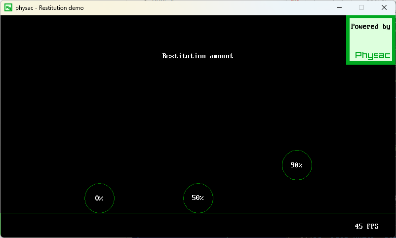
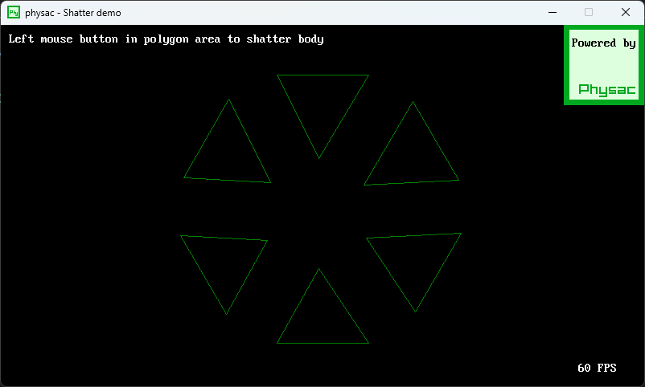
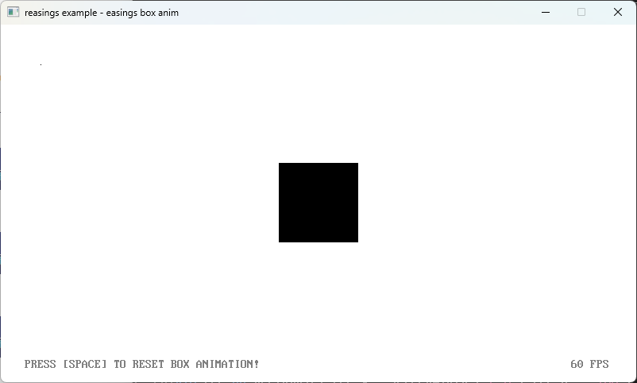

# Physac for QB64-PE


[Physac for QB64-PE](https://github.com/a740g/Physac64) is a [QB64-PE](https://www.qb64phoenix.com/) binding library for [Physac](https://github.com/victorfisac/Physac). Physac is a small 2D physics engine written in C. The engine uses a fixed time-step thread loop to simluate physics. A physics step contains the following phases: get collision information, apply dynamics, collision solving and position correction. It uses a very simple TYPE for physic bodies with a position vector to be used in any 2D / 3D rendering API.

This version is completely standalone and does not have any [raylib-64](https://github.com/a740g/raylib-64) dependencies. As a bonus, it also contains the [reasings](https://github.com/raylib-extras/reasings) library (Robert Penner's [easing equations](https://easings.net/)) and [raymath](https://www.raylib.com/cheatsheet/raymath_cheatsheet.html) (raylib math library).








## API

The PhysicsBody TYPE contains all dynamics information and collision shape. The user may use the following structure components:

```vb
TYPE PhysicsBody
    AS _UNSIGNED LONG id ' Reference unique identifier
    AS _BYTE enabled ' Enabled dynamics state (collisions are calculated anyway)
    AS Vector2 position ' Physics body shape pivot
    AS Vector2 velocity ' Current linear velocity applied to position
    AS Vector2 force ' Current linear force (reset to 0 every step)
    AS SINGLE angularVelocity ' Current angular velocity applied to orient
    AS SINGLE torque ' Current angular force (reset to 0 every step)
    AS SINGLE orient ' Rotation in radians
    AS SINGLE inertia ' Moment of inertia
    AS SINGLE inverseInertia ' Inverse value of inertia
    AS SINGLE mass ' Physics body mass
    AS SINGLE inverseMass ' Inverse value of mass
    AS SINGLE staticFriction ' Friction when the body has not movement (0 to 1)
    AS SINGLE dynamicFriction ' Friction when the body has movement (0 to 1)
    AS SINGLE restitution ' Restitution coefficient of the body (0 to 1)
    AS _BYTE useGravity ' Apply gravity force to dynamics
    AS _BYTE isGrounded ' Physics grounded on other body state
    AS _BYTE freezeOrient ' Physics rotation constraint
    AS PhysicsShape shape ' Physics body shape information (type, radius, vertices, normals)
END TYPE
```

The following Physac API functions are available for the user:

```vb
' Initializes physics values, pointers and (optionbally) creates the physics loop thread
SUB InitPhysics (BYVAL isThreaded AS _BYTE)
' Run physics step, to be used if isThreaded is set to FALSE when calling InitPhysics
SUB RunPhysicsStep
'Sets physics fixed time step in milliseconds. 1.666666 by default
SUB SetPhysicsTimeStep (BYVAL delta AS DOUBLE)
' Returns true if physics thread is currently enabled
FUNCTION IsPhysicsEnabled%%
' Sets physics global gravity force
SUB SetPhysicsGravity (BYVAL x AS SINGLE, BYVAL y AS SINGLE)
' Gets a physics body TYPE value from a pointer
SUB GetPhysicsBodyOffset (body AS PhysicsBody, BYVAL bodyOffset AS _UNSIGNED _OFFSET)
' Sets a physics body TYPE value to a pointer
SUB SetPhysicsBodyOffset (BYVAL bodyOffset AS _UNSIGNED _OFFSET, body AS PhysicsBody)
' Creates a new circle physics body with generic parameters
FUNCTION CreatePhysicsBodyCircle~%& (position AS Vector2, BYVAL radius AS SINGLE, BYVAL density AS SINGLE)
' Creates a new circle physics body with generic parameters
SUB CreatePhysicsBodyCircle (position AS Vector2, BYVAL radius AS SINGLE, BYVAL density AS SINGLE, retVal AS PhysicsBody)
' Creates a new rectangle physics body with generic parameters
FUNCTION CreatePhysicsBodyRectangle~%& (position AS Vector2, BYVAL wid AS SINGLE, BYVAL hgt AS SINGLE, BYVAL density AS SINGLE)
' Creates a new rectangle physics body with generic parameters
SUB CreatePhysicsBodyRectangle (position AS Vector2, BYVAL wid AS SINGLE, BYVAL hgt AS SINGLE, BYVAL density AS SINGLE, retVal AS PhysicsBody)
' Creates a new polygon physics body with generic parameters
FUNCTION CreatePhysicsBodyPolygon~%& (position AS Vector2, BYVAL radius AS SINGLE, BYVAL sides AS LONG, BYVAL density AS SINGLE)
' Creates a new polygon physics body with generic parameters
SUB CreatePhysicsBodyPolygon (position AS Vector2, BYVAL radius AS SINGLE, BYVAL sides AS LONG, BYVAL density AS SINGLE, retVal AS PhysicsBody)
' Adds a force to a physics body
SUB PhysicsAddForce (BYVAL body AS _UNSIGNED _OFFSET, force AS Vector2)
' Adds a angular force to a physics body
SUB PhysicsAddTorque (BYVAL body AS _UNSIGNED _OFFSET, BYVAL amount AS SINGLE)
' Shatters a polygon shape physics body to little physics bodies with explosion force
SUB PhysicsShatter (BYVAL body AS _UNSIGNED _OFFSET, position AS Vector2, BYVAL force AS SINGLE)
' Returns the current amount of created physics bodies
FUNCTION GetPhysicsBodiesCount&
' Returns a physics body of the bodies pool at a specific index
FUNCTION GetPhysicsBody~%& (BYVAL index AS LONG)
' Returns a physics body of the bodies pool at a specific index
SUB GetPhysicsBody (BYVAL index AS LONG, retVal AS PhysicsBody)
' Returns the physics body shape type (PHYSICS_CIRCLE or PHYSICS_POLYGON)
FUNCTION GetPhysicsShapeType& (BYVAL index AS LONG)
' Returns the amount of vertices of a physics body shape
FUNCTION GetPhysicsShapeVerticesCount& (BYVAL index AS LONG)
' Returns transformed position of a body shape (body position + vertex transformed position)
SUB GetPhysicsShapeVertex (BYVAL body AS _UNSIGNED _OFFSET, BYVAL vertex AS LONG, retVal AS Vector2)
' Sets physics body shape transform based on radians parameter
SUB SetPhysicsBodyRotation (BYVAL body AS _UNSIGNED _OFFSET, BYVAL radians AS SINGLE)
' Unitializes physics pointers and closes physics loop thread
SUB DestroyPhysicsBody (BYVAL body AS _UNSIGNED _OFFSET)
' Unitializes physics pointers and closes physics loop thread
SUB ClosePhysics
```

## EXAMPLES

There are 6 examples. 5 of them are for Physac and 1 for reasings.

# NOTE

This library requires the latest 64-bit version of [QB64-PE](https://github.com/QB64-Phoenix-Edition/QB64pe/releases/latest).
